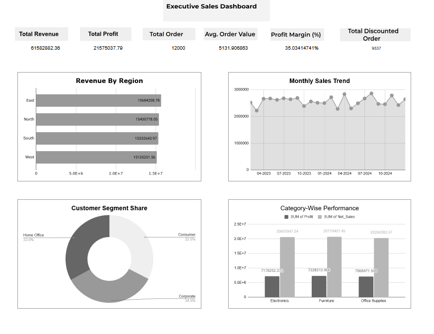

# 📊 Sales Analytics Dashboard (Excel / Google Sheets)

## Overview

This project demonstrates an end-to-end sales analytics workflow using Excel / Google Sheets. The goal was to analyze sales performance across regions, product categories, customer segments, and time periods, and to present insights through an executive-level interactive dashboard.

The project focuses on data cleaning, analysis, and business storytelling, rather than just visualization.

## Dataset

- ~12,000 sales transactions

- Time period: 2023–2024

- Includes region, category, customer segment, revenue, profit, discounts, and order-level metrics

### Note:
The dataset is synthetic and was generated using ChatGPT to simulate real-world sales data for learning and portfolio demonstration purposes.

## Tools & Skills Used

- Excel / Google Sheets

- Advanced formulas: SUMIFS, COUNTIFS, IF, IFERROR, EOMONTH

- Pivot Tables & Pivot Charts

- KPI calculations and trend analysis

- Dashboard design & layout

- Business insights & reporting

## Key Analysis Performed

- Revenue and profit analysis by region

- Monthly sales trend analysis (multi-year)

- Category-wise revenue and profitability comparison

- Customer segment contribution analysis

- Discount impact on sales and margins

## Dashboard Highlights

- Executive KPIs: Total Revenue, Profit, Orders, AOV, Profit Margin

- Interactive filters (Region, Year, Sales Channel)

- Clean, one-page dashboard layout

- Business-focused insights and recommendations

## Key Insights

- Strong overall revenue with stable monthly trends

- High dependency on discounted orders impacts margins

- Furniture category delivers higher profitability compared to other categories

- Balanced customer segment contribution reduces dependency risk

## Files in This Repository

- /dataset → Raw and cleaned datasets

- /dashboard → Excel / PDF dashboard

- /report → One-page executive insights report

- /images → Dashboard preview screenshots

## How to Use

- Download the Excel file from the Dataset folder

- Explore pivot tables and KPIs

- Review the insights report for business conclusions

# Author

# Divyanshu Verma
# Aspiring Data Analyst | Excel | SQL | Python | Power BI
